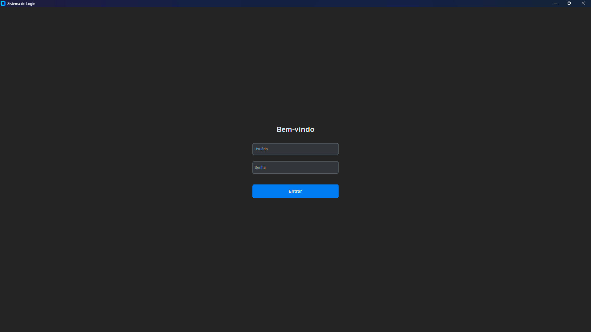
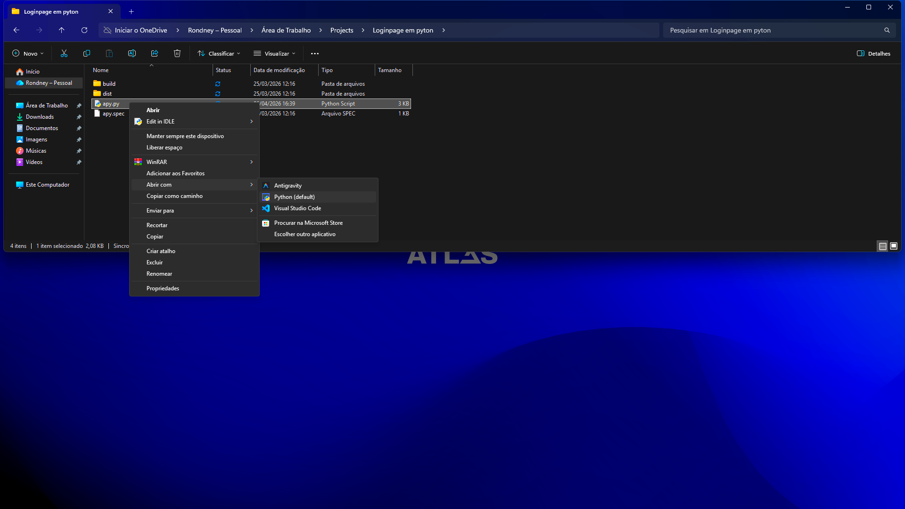

# 🔐 Sistema de Login em Python

Interface gráfica de login desenvolvida com CustomTkinter.

Esse código cria uma interface gráfica de login usando a biblioteca customtkinter.
A aplicação é exibida em modo escuro e possui uma janela com título e tamanho definidos.
Na tela, há um campo para digitar o nome de usuário.
Também há um campo para senha, onde os caracteres ficam ocultos.
Um botão “Entrar” é responsável por iniciar a validação dos dados.
Quando clicado, ele chama a função validar_login().
Essa função captura os valores digitados pelo usuário.
Em seguida, compara com credenciais fixas definidas no código.
Se estiverem corretas, mostra uma mensagem de sucesso na tela.
Caso contrário, exibe uma mensagem de erro informando falha no login.

- Preview

  

- Sobre o projeto

O sistema permite que o usuário insira um nome e uma senha, validando as credenciais com dados fixos no código.  
Após a verificação, o sistema retorna um feedback visual indicando sucesso ou erro.

- 🚀 Tecnologias utilizadas

- Python
- CustomTkinter

- Funcionalidades

- Interface gráfica moderna em modo escuro  
- Campo de usuário e senha  
- Validação de login  
- Mensagens de sucesso e erro na tela  

- Como executar

  clicando no arquivo e abrindo em python.

  

  

  

