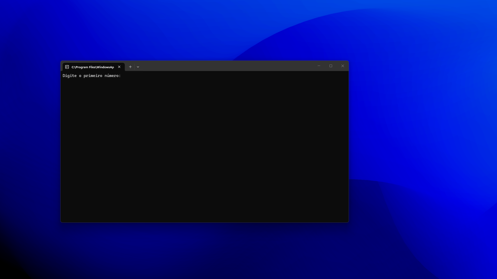

- Calculadora Simples em Python

Este é um projeto de **calculadora simples desenvolvida em Python, com o objetivo de praticar conceitos básicos de programação, como entrada de dados, estruturas condicionais e operações matemáticas.

preview

  

- Funcionalidades

* Soma
* Subtração
* Multiplicação
* Divisão
* Interface simples via terminal

- Tecnologias utilizadas

* Python 3
* 

- Como executar o projeto

- 

- Execute o arquivo: python calculadora.py

- Objetivo do projeto

Este projeto foi criado com foco em aprendizado, ajudando a reforçar conceitos fundamentais da linguagem Python e lógica de programação.

